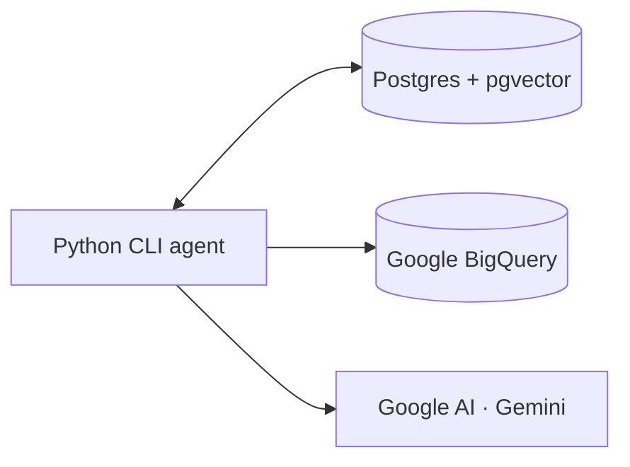
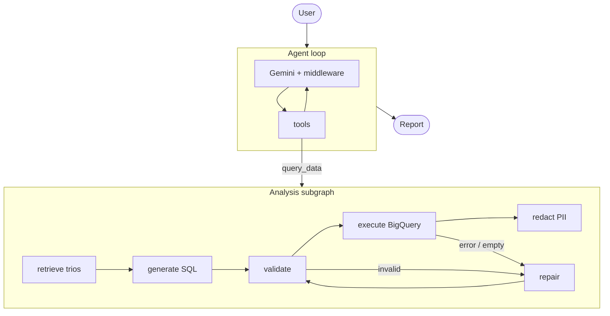

# Retail Data Agent

Ask about sales in plain English; get a written report from read-only SQL.





## Setup

1. A GCP project with the **BigQuery API enabled**.
2. A service-account key with the **BigQuery User** role (we use BigQuery User — it has everything needed).
3. Paste your Gemini API key into `.env`: `GOOGLE_API_KEY=...`
4. Drop the service-account key at `secrets/gcp.json`.

```bash
docker compose -p p2gamma up
```
