# Use Case Diagrams

**Type**: use_case_diagrams
**State**: completed
**Created**: 2026-05-26 13:46:07.841969
**Updated**: 2026-05-27 10:12:43.146553

---

## Use Case Documentation: AI Data Analysis Chat Assistant

This document provides a detailed breakdown of the user interactions and system behaviors for the AI Data Analysis Chat Assistant. It includes a use case diagram, actor definitions, and comprehensive descriptions of the primary use cases, reflecting the latest system requirements.

### 1. Use Case Diagram

The diagram below illustrates the actors and their interactions with the system's main functionalities.

```mermaid
flowchart TD
  subgraph Actors
    direction LR
    manager["Manager"]
    analyst["Data Analyst"]
    businessAdmin["Business Administrator"]
    systemAdmin["System Administrator"]
  end

  subgraph system["AI Data Analysis Chat Assistant System"]
    direction TB
    uc1(["UC-01: Query Data for Analysis"])
    uc2(["UC-02: Manage Saved Reports"])
    uc3(["UC-03: Manage Personal Preferences"])
    uc4(["UC-04: Submit Feedback on Report"])
    uc5(["UC-05: Delete Reports with Confirmation"])
    uc6(["UC-06: Review & Promote Interaction"])
    uc7(["UC-07: Curate Golden Knowledge"])
    uc8(["UC-08: Manage Agent Persona"])
    uc9(["UC-09: Monitor System Health"])
    uc10(["UC-10: Run Pre-Deployment Evals"])
    uc11(["UC-11: Delete User Data (GDPR Cascade)"])

    subgraph included_use_cases["System Use Cases"]
      direction LR
      iuc1(["Redact PII"])
      iuc2(["Self-Correct SQL Query"])
      iuc3(["Reject Malicious/OOS Query"])
      iuc4(["Enforce Per-User Budget & Rate Limits"])
      iuc5(["Handle External Service Failure"])
      iuc6(["Answer Schema Discovery Question"])
    end
  end

  manager --> uc1
  manager --> uc2
  manager --> uc3
  manager --> uc4
  manager --> uc5
  analyst --> uc6
  analyst --> uc7
  businessAdmin --> uc8
  systemAdmin --> uc9
  systemAdmin --> uc10
  systemAdmin --> uc11

  uc1 -. include .-> iuc1
  uc1 -. include .-> iuc2
  uc1 -. include .-> iuc3
  uc1 -. include .-> iuc4
  uc1 -. include .-> iuc5
  uc1 -. include .-> iuc6
```

### 2. Actor Definitions

*   **Manager (Store/Regional Manager):** The primary non-technical user. Queries data, manages their own saved reports, sets preferences, and provides feedback on responses to drive system improvement.
*   **Data Analyst:** A domain expert responsible for the quality of the "Golden Knowledge" base. Reviews high-quality interactions flagged by Managers and promotes them into approved (Question → SQL → Report) Trios. Also authors Trios manually to enhance system accuracy.
*   **Business Administrator:** A non-technical user with privileges to update the agent's persona, tone, and communication style via an admin interface, ensuring alignment with business needs without requiring a code deployment.
*   **System Administrator (Data/ML Engineer):** A technical user responsible for monitoring system health, debugging failures via detailed traces, managing the QA evaluation pipeline, and overseeing operational performance.

### 3. Use Case Descriptions

#### UC-01: Query Data for Analysis

*   **ID:** UC-01
*   **Actor(s):** Manager
*   **Description:** The user asks a question in natural language to get insights from the company's retail data. The system retrieves relevant, analyst-approved "Golden Knowledge" Trios to use as few-shot examples, guiding the generation of a new, accurate SQL query. The system ensures the response is secure, free of PII, and formatted to the user's preference.
*   **Pre-conditions:**
    *   The user is authenticated and has access to the chat interface.
    *   The system has a read-only connection to the retail database.
    *   The PII allow-list (columns redacted at the pre-LLM step) is loaded, and the at-source authorized view (for public datasets) or policy-tag taxonomy (for owned datasets) is in place.
    *   The active agent persona configuration is loaded.
    *   User formatting preferences are loaded (or defaults are applied).
    *   Prior conversation context for the current thread, if any, is loaded so follow-up questions can be resolved against earlier turns.
*   **Post-conditions:**
    *   The user receives a summarized, human-readable report answering their question.
    *   No PII appears in logs, traces, or the final output.
    *   The full interaction (question, retrieved Trios, generated SQL, report, feedback controls) is logged to the interactions store with a trace ID.
    *   Cost and latency metrics for the interaction are recorded.

**Primary Flow:**
1.  Manager submits a question in the chat interface.
2.  System classifies the user's intent (e.g., analysis, destructive operation, out-of-scope).
3.  System embeds the question and retrieves the top-k most similar (Question → SQL → Report) Trios from the Golden Knowledge base via semantic search.
4.  System generates a new SQL query using the retrieved Trios as few-shot examples to guide the LLM.
5.  System validates the generated SQL (e.g., read-only, allowed tables).
6.  System executes the validated SQL against the live database.
7.  System redacts all PII from the raw query results before passing them to the LLM for summarization.
8.  System synthesizes a human-readable report from the redacted data, using the retrieved Trio reports as style examples and applying the user's formatting preferences.
9.  System applies a final PII-detection guardrail to the generated report as a defense-in-depth measure.
10. System streams the final report to the Manager with feedback controls (thumbs-up/down).

**Exception Flows:**
*   **E-1.1a (Out-of-Scope Question):** If the system classifies the question as unrelated to business data analysis, it politely declines and provides examples of valid questions.
*   **E-1.1b (Prompt Injection / Malicious Input):** If the system detects a malicious attempt, it refuses to process the request, logs it as a high-severity security event, and does not execute any query.
*   **E-1.2 (SQL Execution Error):** If the generated SQL fails due to a syntax error, the system attempts to self-correct up to a predefined limit. It feeds the error message and schema back to the LLM for repair. If unrecoverable or retries are exhausted, it returns a graceful failure message.
*   **E-1.3 (Empty Result Set):** If a valid query returns 0 rows, the system attempts a bounded re-generation with the empty-result context. If still empty, it returns a graceful response indicating no matching data was found and suggests potential refinements.
*   **E-1.4 (External Service Failure):** If an external dependency (LLM provider, analytical database, vector store, observability sink) fails, the system retries transient failures with exponential backoff, fails over to a configured alternative LLM provider where available, treats observability sinks as non-blocking and fail-silent, and — when degradation is unavoidable — returns a clear plain-language temporary-unavailability message rather than a technical error.
*   **E-1.5 (Per-Request Cost / Token Budget Exceeded):** If a request exceeds its per-request token budget (e.g., during repeated self-correction), further attempts are aborted and a graceful failure message is returned.
*   **E-1.6 (Per-User Budget or Rate Limit Exceeded):** If the user has exceeded their daily cost cap or per-user request-rate window, the request is rejected at the gateway with a friendly "daily budget exceeded" / "too many requests" response without invoking the LLM.
*   **E-1.7 (Schema Discovery Question):** If intent classification identifies the question as a schema-discovery request ("what data can I ask about?", "what columns does X have?"), the system answers from a curated business-language schema description without generating or executing an analytical SQL query against the source data. PII columns are described as "redacted" rather than enumerated as queryable.

---

#### UC-02: Manage Saved Reports

*   **ID:** UC-02
*   **Actor(s):** Manager
*   **Description:** The user saves useful reports to a personal library for later viewing or retrieves a list of previously saved reports.
*   **Pre-conditions:**
    *   The user is authenticated.
*   **Post-conditions:**
    *   The user's personal report library is updated or displayed.

**Primary Flow (Save Report):**
1.  After receiving a report from UC-01, the user issues a command to save it.
2.  The system saves the report to the user's personal library, associating it with their user ID.
3.  The system confirms that the report has been saved.

**Primary Flow (View Reports):**
1.  User issues a command to view their reports (e.g., "Show my saved reports").
2.  The system retrieves and displays a list of all reports saved by that user.

*Note: Deleting reports is a high-stakes action handled separately in UC-05.*

---

#### UC-03: Manage Personal Preferences

*   **ID:** UC-03
*   **Actor(s):** Manager
*   **Description:** The user sets or updates their preference for how reports should be formatted (e.g., tables, bullet points).
*   **Pre-conditions:**
    *   The user is authenticated.
*   **Post-conditions:**
    *   The user's formatting preference is stored in their profile.
    *   All future reports generated for the user will adhere to this preference.

**Primary Flow:**
1.  User issues a command to set a preference (e.g., "From now on, show my results in tables").
2.  The system recognizes the intent and updates the user's profile with the new preference.
3.  The system confirms that their preference has been saved.

---

#### UC-04: Submit Feedback on Report

*   **ID:** UC-04
*   **Actor(s):** Manager
*   **Description:** The user provides positive or negative feedback on a generated report, which is a critical input for the system's continuous improvement loop.
*   **Pre-conditions:**
    *   The user has received a report from UC-01.
*   **Post-conditions:**
    *   The feedback is logged to the interactions store.
    *   Positively-rated interactions are added to a review queue for the Data Analyst.
    *   Negatively-rated interactions are logged for quality analysis.

**Primary Flow:**
1.  The user clicks the thumbs-up or thumbs-down icon next to a generated report.
2.  The system logs the feedback (question, SQL, report, rating) to an interactions database.
3.  If the feedback is positive, the interaction is flagged and added to a review queue for an Analyst to potentially promote it to the Golden Knowledge base.

---

#### UC-05: Delete Reports with Confirmation

*   **ID:** UC-05
*   **Actor(s):** Manager
*   **Description:** The user deletes one or more saved reports using a secure, multi-step confirmation process to prevent accidental data loss.
*   **Pre-conditions:**
    *   The user is authenticated.
*   **Post-conditions:**
    *   The specified reports are soft-deleted from the user's library.
    *   A detailed audit log entry is created for the action.

**Primary Flow:**
1.  User issues a command to delete reports (e.g., "Delete my reports about Client X").
2.  System performs an authorization check (user can only delete reports they own) and gathers the matching report IDs scoped to the user.
3.  System builds a preview (titles, count, and the captured ID list) and pauses execution via the LangGraph interrupt; preview is streamed to the user.
4.  User confirms by typing the count-bound token `CONFIRM-DELETE-N` (where N matches the previewed count) or rejects.
5.  On resume, the system runs an idempotent soft-delete (`UPDATE saved_reports SET deleted_at = NOW() WHERE id IN (preview_ids) AND user_id = $user AND deleted_at IS NULL`) — affecting only the previewed rows even if data has shifted in the interrupt window.
6.  System writes an audit-log row keyed on `op_id = HMAC(user, thread, matched_ids)` with `INSERT … ON CONFLICT DO NOTHING` so a double-resume cannot duplicate the audit entry.
7.  System confirms to the user, surfacing any drift ("M of the N reports you previewed had already been deleted; P newer reports matching your criteria were added after the preview and were not affected — re-run to include them").

---

#### UC-06: Review and Promote Interaction

*   **ID:** UC-06
*   **Actor(s):** Data Analyst
*   **Description:** An Analyst reviews high-quality, user-approved interactions and promotes them to the Golden Knowledge base to improve future AI responses.
*   **Pre-conditions:**
    *   The user is authenticated and has Analyst privileges.
*   **Post-conditions:**
    *   An approved interaction is inserted as a new row in `golden_assets` with `kind='trio'`, `status='active'`, and an embedding computed from the structured composite key (tags + question + report summary).

**Primary Flow:**
1.  Analyst opens the admin UI and views the queue of positively-rated interactions.
2.  For each interaction, the Analyst reviews the original question, the generated SQL, and the generated report.
3.  The Analyst can approve the interaction as-is, edit the SQL or report for correctness and style, or reject it.
4.  If approved, the system builds the structured embedding key, computes the embedding, and inserts the finalized Trio into `golden_assets`. The new row becomes available to subsequent retrievals immediately.

**Business Rule (FR-1.5.7):** Positive end-user feedback alone never promotes an interaction. Promotion into the Golden Knowledge base requires an explicit analyst approve/edit action in this use case. This invariant prevents low-quality or attacker-influenced interactions from poisoning the few-shot example pool.

---

#### UC-07: Curate Golden Knowledge

*   **ID:** UC-07
*   **Actor(s):** Data Analyst
*   **Description:** The Analyst performs general maintenance on the Golden Knowledge base, including manual creation and deprecation of Trios, to ensure examples remain high-quality and relevant.
*   **Pre-conditions:**
    *   The user is authenticated and has Analyst privileges.
*   **Post-conditions:**
    *   The `golden_assets` table is updated (insert / edit / status change to `deprecated` or `quarantined`).

**Primary Flow:**
1.  The Analyst uses an admin UI to manually author a new Trio, glossary entry, or schema chunk (inserts into `golden_assets` with the appropriate `kind`), edit an existing one, or deprecate an outdated one.
2.  A nightly Cloud Scheduler job runs schema-drift detection: for every active Trio it dry-runs the stored SQL against the live BigQuery schema, marks failing Trios `status='quarantined'`, and routes them to the curation queue with the captured error message. Quarantined rows are excluded from retrieval until the analyst re-validates them.

**Exception Flows:**
*   **E-7.1 (Mass quarantine):** If a single drift-detection run quarantines more than a configurable fraction of active Trios, the system raises a high-severity operational alert (indicating a probable schema-level change) so an analyst or DBA can investigate before the next user query depends on a degraded few-shot pool.

---

#### UC-08: Manage Agent Persona

*   **ID:** UC-08
*   **Actor(s):** Business Administrator
*   **Description:** An administrator proposes a new agent persona (tone, communication style, required sections) via an admin panel. The proposal becomes active only after the configured approval gate is satisfied (`PERSONA_REQUIRE_DISTINCT_PROPOSER`), ensuring — when enabled — that a single compromised admin account cannot silently rewrite agent instructions.
*   **Pre-conditions:**
    *   The proposer is authenticated and has Business Administrator privileges.
    *   At least one additional approver with the same or higher privilege is available.
*   **Post-conditions:**
    *   A new row exists in `persona_versions` with the proposed payload and the activation status (active or pending) recorded.
    *   On activation: the previous active row is set `active=FALSE` and the new row is set `active=TRUE` in a single transaction; an `audit_log` row captures author, approvers, activation time, and a diff hash.
    *   New conversations use the updated persona within the in-process cache TTL (30 seconds).

**Primary Flow:**
1.  Administrator logs into the admin panel and opens the persona editor (loaded from the current `active` row in `persona_versions`).
2.  Administrator edits the schema-validated fields (tone, length_target, forbidden_phrases, required_sections, sample_paragraphs) and submits as a *proposal* — a new row is inserted with `active=FALSE` and `approved_by=[proposer]`.
3.  The system notifies the configured approver group (DBA team + designated Engineering reviewer) via Slack/email with a link to the diff.
4.  An approver opens the admin UI, reviews the diff against the current active version, and either approves (appending their `user_id` to `approved_by`) or rejects.
5.  Once the configured approval policy is satisfied (`PERSONA_REQUIRE_DISTINCT_PROPOSER`: when enabled, `approved_by` must contain at least one user_id that is not the proposer; when disabled, the proposer alone suffices), the admin UI offers activation; activating runs the single-transaction toggle described in the post-conditions.

**Exception Flows:**
*   **E-8.1 (Validation failure):** If the proposed payload contains unknown JSON keys or exceeds field-length bounds, the schema validator rejects the proposal at submit time and surfaces the validation error to the proposer.
*   **E-8.2 (Self-approval blocked):** When `PERSONA_REQUIRE_DISTINCT_PROPOSER` is enabled and the same user_id appears as both proposer and sole approver, the system refuses to activate; a distinct approver is required. (When the flag is disabled, solo activation is permitted by policy.)

---

#### UC-09: Monitor System Health

*   **ID:** UC-09
*   **Actor(s):** System Administrator
*   **Description:** An administrator views a dashboard to monitor the agent's performance, track key metrics, and access detailed logs and traces for debugging.
*   **Pre-conditions:**
    *   The user is authenticated and has System Administrator privileges.
*   **Post-conditions:**
    *   The administrator gains insight into the system's operational status.

**Primary Flow:**
1.  Administrator accesses the observability dashboard.
2.  The dashboard displays key metrics, including:
    *   Query success/failure rates, response times, and user engagement.
    *   Cost per request, token usage, and retry rates.
    *   PII redaction events and a destructive-action audit trail.
3.  Administrator can access detailed, per-request execution traces showing the full sequence of LLM calls, retrieved Trios, generated SQL, and validation outcomes.

---

#### UC-10: Run Pre-Deployment Evals

*   **ID:** UC-10
*   **Actor(s):** System Administrator
*   **Description:** A System Administrator runs a quality assurance evaluation suite against a release candidate to prevent regressions before deployment.
*   **Pre-conditions:**
    *   A release candidate is available for testing.
    *   A held-out evaluation set of analyst-approved Trios exists.
*   **Post-conditions:**
    *   A quality report is generated.
    *   The deployment is automatically blocked if quality scores fall below configured thresholds.

**Primary Flow:**
1.  Administrator triggers the evaluation pipeline against a release candidate.
2.  The system runs the held-out set of questions through the agent flow.
3.  The pipeline scores the results on SQL correctness, faithfulness to the retrieved data (using an LLM-as-judge), and other quality metrics.
4.  The system compares the scores against the production version and blocks deployment if a significant regression is detected.

#### UC-11: Delete User Data (GDPR Cascade)

*   **ID:** UC-11
*   **Actor(s):** System Administrator
*   **Description:** An administrator issues a single `delete_user_data(user_id)` operation that cascades across every store keyed on that user's identity, satisfying a GDPR right-to-be-forgotten request in one auditable operation.
*   **Pre-conditions:**
    *   The administrator is authenticated and a member of the explicit administrator group authorized for this operation (IAM-gated).
    *   A legitimate deletion request has been received (e.g., from the legal team).
*   **Post-conditions:**
    *   Per-store outcomes:
        *   `saved_reports` — soft-deleted via `deleted_at` timestamp.
        *   Agent long-term memory (per-user namespace) — hard-deleted.
        *   Agent thread checkpoints owned by the user — hard-deleted.
        *   Per-user cost-attribution rows and observability traces — anonymized (aggregate dashboards and eval failure-mode samples preserved).
        *   `audit_log` — **not deleted**, per GDPR Article 17(3)(b) legal-obligation carve-out.
    *   An immutable `audit_log` row is written capturing the acting administrator, target user, timestamp, and per-store affected-row counts.
    *   A daily reconciliation job thereafter verifies no `user_id` from the deletion appears in any store other than `audit_log`.

**Primary Flow:**
1.  Administrator invokes the `delete_user_data` operation with a target `user_id` from the admin UI or operations console.
2.  The system performs an IAM check and rejects the request if the caller is not in the authorized administrator group.
3.  The system builds a preview per store: count of reports, threads, preference rows, anonymizable cost-attribution and trace rows.
4.  The preview is streamed to the administrator who must supply a typed confirmation token to proceed.
5.  On confirmation, the system runs the cascade transactionally per store with the post-condition semantics above (soft-delete / hard-delete / anonymize).
6.  The system writes the audit-log entry and returns a final report of per-store affected-row counts.

**Exception Flows:**
*   **E-11.1 (Unauthorized caller):** A non-admin invocation is rejected and logged as a high-severity security event.
*   **E-11.2 (Reconciliation drift):** If the daily reconciliation job detects any residual `user_id` reference in a non-`audit_log` store after a processed deletion, it raises a high-severity alert to on-call.

---

### 4. System Use Cases (Included)

These are internal, non-actor-facing use cases that are included as part of other primary flows.

*   **Redact PII:** <<included>> by UC-01. Takes a raw query result set and a PII configuration. It redacts specified PII from the data before any LLM sees it. A second guardrail checks the final output before it is shown to the user.
*   **Self-Correct SQL Query:** <<included>> by UC-01. On a SQL execution error, the system feeds the error message and schema back to an LLM for repair, with a predefined maximum number of retries to control cost and latency.
*   **Reject Malicious/OOS Query:** <<included>> by UC-01. The system constrains what the agent may emit via a structured response schema, treats retrieved content and tool outputs as data rather than instructions, and gates any state-mutating tool behind explicit HITL confirmation. Out-of-scope questions are met with a polite redirection per the off-topic policy. (Concrete implementation — including any inline prompt-injection classifier — is defined in the System Design.)
*   **Enforce Per-User Budget & Rate Limits:** <<included>> by UC-01. Before any LLM call, the system checks (a) the user's per-user request-rate window and (b) the user's daily cost cap derived from a per-user cost-attribution table (LLM tokens, embedding tokens, analytical-database bytes-billed). Over-cap or over-rate requests are rejected with a friendly message and never invoke the LLM. A high-cost-per-hour alert fires to on-call ahead of the daily cap. A reconciliation job periodically compares in-process attribution to the cloud provider's official billing export and alerts on drift.
*   **Handle External Service Failure:** <<included>> by UC-01. Transient failures of external dependencies are retried with exponential backoff (distinct from the semantic SQL self-correction loop). Where configured, the LLM call layer fails over to an alternative provider. Observability sinks are non-blocking and fail-silent: a tracing or logging outage shall not block, slow, or crash a user request. Unrecoverable failures surface as a plain-language temporary-unavailability message.
*   **Answer Schema Discovery Question:** <<included>> by UC-01. When intent classification identifies a schema-discovery question, the system answers from a curated business-language schema description (available entities, the kinds of fields each contains) without generating or executing an analytical SQL query against the source data. PII columns are described as "redacted" rather than enumerated as queryable.
