# System Design (High-Level Design)

**Type**: system_design
**State**: completed
**Updated**: 2026-05-29

---

# AI Data Analysis Chat Assistant — High-Level Design

## 1. Overview

**What the system does.** Non-technical retail managers ask questions in natural language. The system retrieves analyst-curated examples ("Golden Trios": Question → SQL → Report), generates and runs SQL against a read-only BigQuery dataset, redacts PII, and synthesizes a business-language report in the user's preferred format and the configured agent persona. It supports a personal saved-reports library with human-gated deletion, a continuous-improvement loop driven by analyst curation, configurable persona, full observability, pre-deployment evaluation, and GDPR data-subject deletion.

**Design ethos.** Safety and quality invariants are made *structural* (enforced by framework topology and middleware) rather than left to LLM discretion. Complexity is added only on a documented trigger. Every cross-cutting concern that LangChain V1 ships as tested middleware is used rather than hand-rolled.

---

## 2. Architecture at a Glance

### 2.1 Master component & data-flow diagram

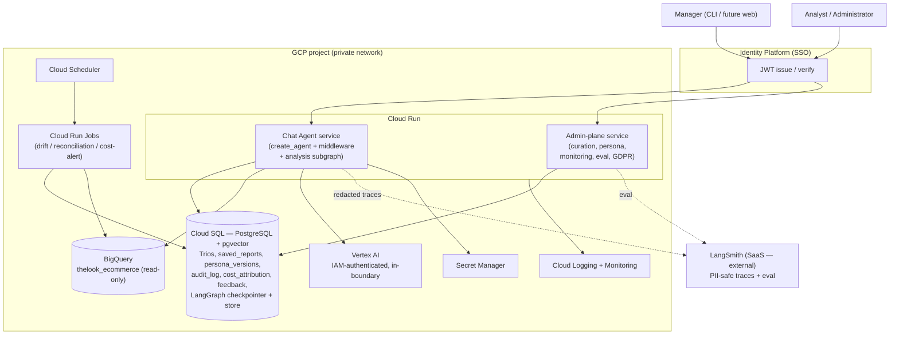

### 2.2 Deployment topology

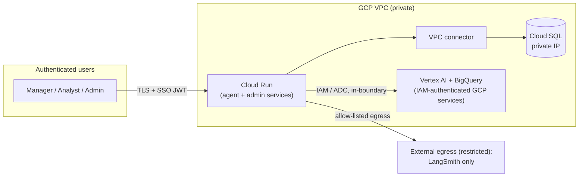

**Operated components:** the Cloud Run service(s) and the Cloud SQL instance. Everything else is a managed GCP service we configure (Vertex AI, BigQuery, Secret Manager, Identity Platform, Cloud Scheduler, Logging, Monitoring) — all reached IAM-authenticated within the GCP boundary — with the sole external SaaS being LangSmith (observability/eval), reached over restricted, allow-listed egress.

---

## 3. Component Catalog

| Component | Responsibility | Serves |
|---|---|---|
| **Chat Agent service** (Cloud Run) | The manager-facing conversational agent: NL → retrieval → SQL → report | R1, UC-01–05 |
| **Analysis subgraph** (inside agent) | Sealed SQL lifecycle: retrieve → generate → validate → execute → redact, with bounded repair | R1, R5, FR-1.2.x, FR-1.7.1–1.7.3 |
| **Middleware stack** (inside agent) | Cross-cutting invariants: PII, HITL, budget, limits, retries, summarization | R2, R3, R5, FR-1.3.x, FR-1.4.4, FR-1.7.x |
| **Admin-plane service** (Cloud Run) | Analyst curation, persona governance, monitoring, eval triggering, GDPR cascade | UC-06–11 |
| **Cloud SQL (Postgres + pgvector)** | All operational state + Trio embeddings + LangGraph checkpointer/store | R3, R4, R8, persistence for all UCs |
| **BigQuery** | Read-only analytical source dataset | brief Dataset Spec, C-1/C-2 |
| **Vertex AI (Gemini models)** | LLM generation + text embeddings; IAM-authenticated GCP service in-boundary | brief Additional Notes, ED-1 |
| **LangSmith (SaaS)** | Per-request traces, evaluation datasets, online eval, feedback annotation | R6, R7, FR-1.8.4, FR-1.9.x |
| **Cloud Logging** | App logs (incl. raw-row data kept inside GCP) | R7, FR-1.8.3 |
| **Cloud Monitoring** | Infra health + alerting | NFR-2.6.2 |
| **Cloud Scheduler → Cloud Run Jobs** | Trio drift detection, GDPR reconciliation, cost-velocity alert, billing reconciliation | FR-1.5.6, FR-1.4.6, FR-1.7.6 |
| **Identity Platform** | SSO identity; issues JWT; sole store of user PII (email/name) | A-4, ID-3, NFR-2.2.3 |
| **Secret Manager** | Encrypted secrets (DB creds, HMAC key); LLM access is via IAM/ADC, not a stored API key | NFR-2.2.1 |

---

## 4. The Agent (Topology)

The agent is a single LangChain V1 `create_agent` (which runs on LangGraph internally). Cross-cutting invariants are enforced by a **composed, ordered middleware stack**. The agent decides *which tool to call*; middleware enforces policy *regardless of the agent's choices*; the analysis subgraph (inside one tool) owns the deterministic SQL lifecycle.

This is the result of two independent multi-reviewer evaluations (the topology chosen over a pure agent-with-tools approach and a pure hand-authored StateGraph). The middleware enforces what would otherwise be hand-built graph nodes; the one workflow that genuinely needs explicit graph control — the bounded SQL repair loop — is a sealed subgraph.

### 4.1 Agent + middleware stack

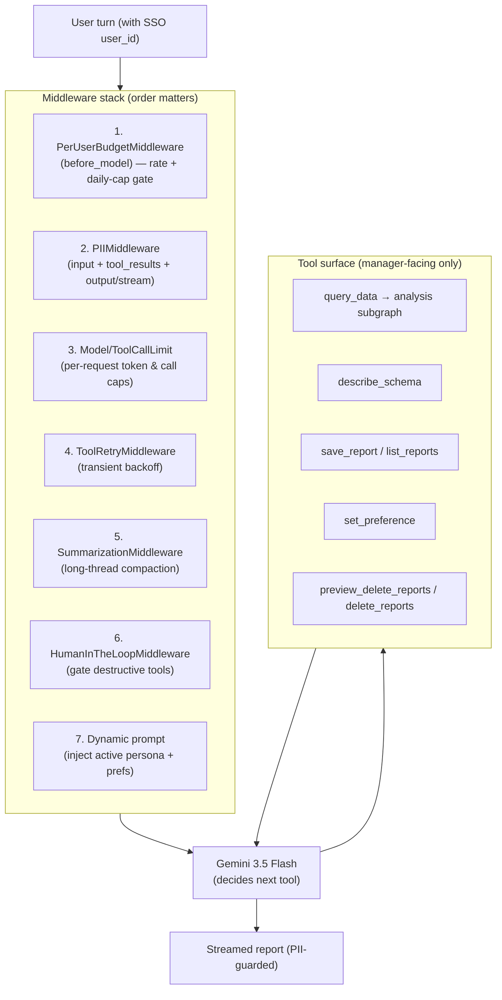

**Registration-order constraint.** `PerUserBudgetMiddleware` is registered **first** so it short-circuits (returns a friendly over-budget message) before any token-spending middleware or model call runs. `wrap_model_call`-style hooks nest first-wraps-all; the budget gate must be the outermost.

**Tool surface.** The agent holds *only* manager-facing tools. Its one destructive tool, `delete_reports` (a manager deleting their own saved reports), is HITL-gated. Privileged admin operations (persona activation, curation, monitoring, eval, and the GDPR `delete_user_data` cascade) are **not** in the agent's tool list at all — they live in the admin plane (§16) and are HITL-gated there. This is a deliberate containment boundary: even a fully prompt-injected agent cannot reach an operation it has no tool for.

### 4.2 Decision rubric — tool vs subgraph vs middleware

| Concern | Mechanism | Why |
|---|---|---|
| Cross-cutting policy that must run regardless of agent choice (PII, HITL, budget, retry) | **Middleware** | Tested, declarative, structurally unskippable |
| Bounded deterministic workflow the agent must NOT ad-lib (SQL repair loop) | **Sealed subgraph** inside a tool | Explicit nodes, state-managed counters, conditional edges, traced |
| A discrete action the agent decides when to invoke (save report, describe schema) | **Tool** | Straight-line logic; agent owns timing |

---

## 5. The Analysis Subgraph

`query_data(question)` is the agent's single analytical tool. Internally it runs **one** compiled StateGraph that owns the entire SQL lifecycle. Retrieval is the first node (the agent cannot skip it). SQL generation and repair share one node-logic so a single generation prompt is reused. PII is redacted at the source boundary, before rows are persisted to checkpoints or traces.

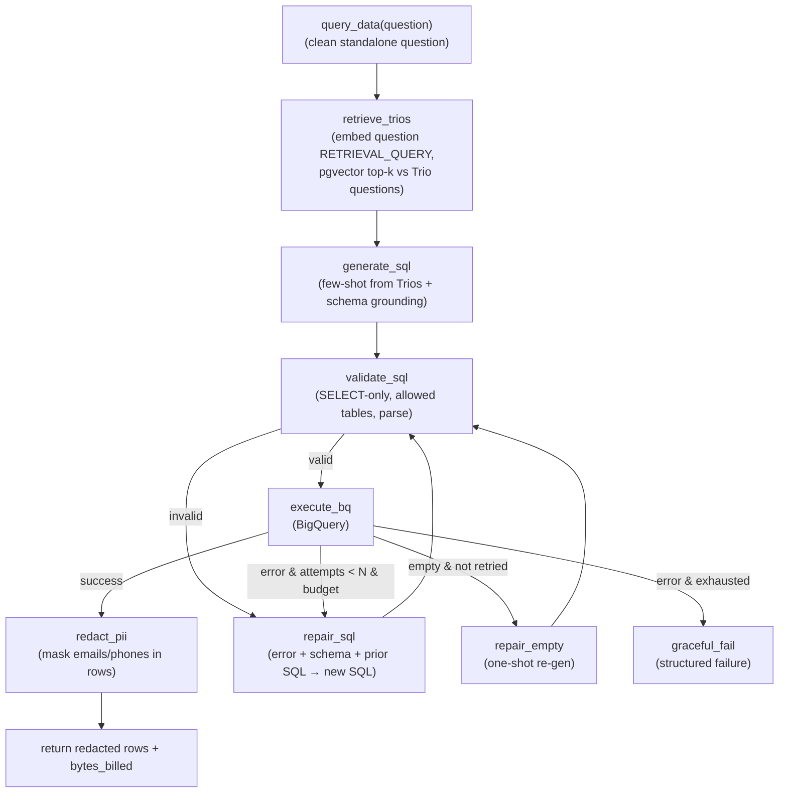

**State:** `{question, trios, sql, attempts, max_attempts, errors[], rows, empty_retried, tokens_used}`.

**Key properties:**
- **Retrieval guaranteed** — `retrieve_trios` is structurally the first node (closes the "agent skips retrieval → quality collapse" failure mode).
- **Generation + repair are one logic site** — `repair_sql` is "generate again, now with the error in context," not a second, divergent generator.
- **Repair is reactive** — the first attempt is just validate→execute; the repair node is reached only on failure.
- **Two distinct failure classes:** *semantic* repair (new SQL each attempt, this subgraph) vs *transient* retry (same call + backoff, handled by `ToolRetryMiddleware`).
- **Bounded** — `max_attempts` (~2–3) and the per-request token budget both terminate the loop into `graceful_fail` (FR-1.7.4).
- **Every node emits a LangSmith span** (FR-1.8.4). Because a subgraph invoked inside a tool is not discoverable via parent `get_state`, observability relies on explicit per-node span emission rather than state introspection.
- **Multi-part questions** are handled one level up: the agent decomposes them and calls `query_data` once per focused sub-question, synthesizing across results.

---

## 6. Request Lifecycle (happy path)

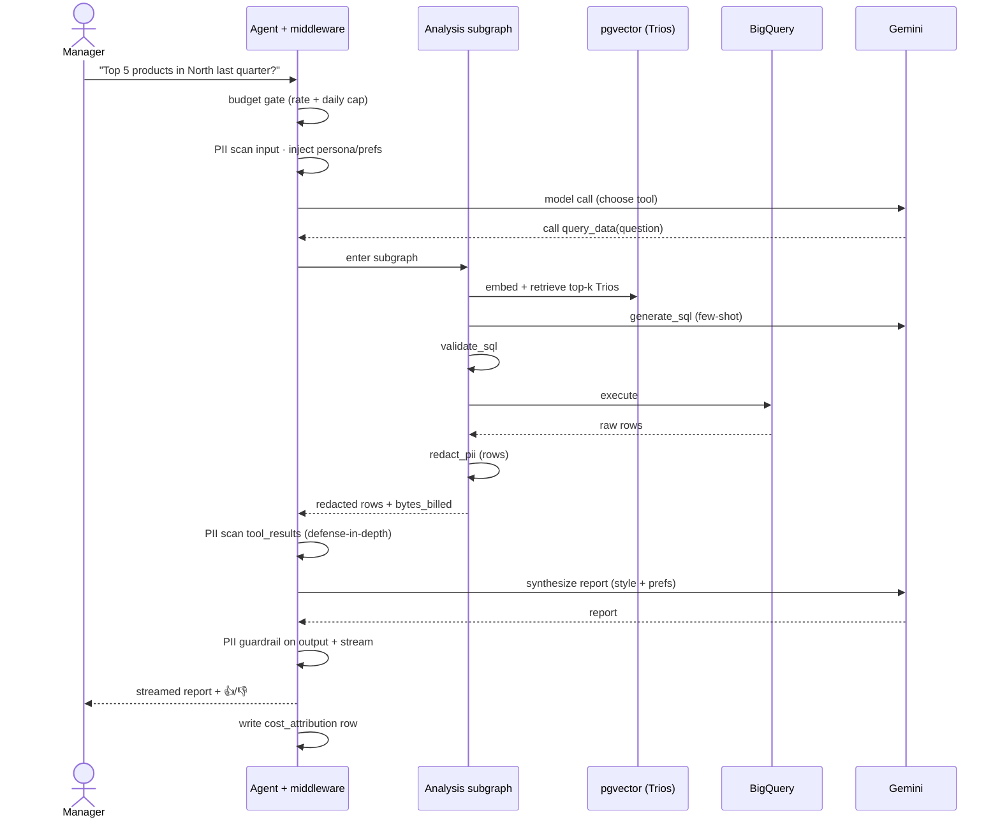

---

## 7. Data Layer

Single **Cloud SQL for PostgreSQL** instance with the `pgvector` extension. It holds all operational state, Trio embeddings, and LangGraph's native checkpointer (thread state) and store (long-term memory). BigQuery is used **only** for the mandated read-only source dataset.

### 7.1 Stores

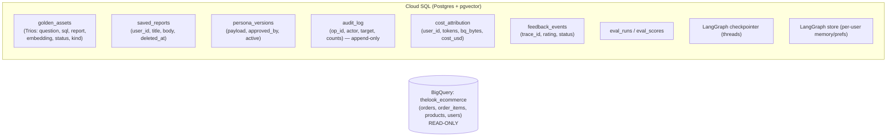

### 7.2 Data classification (drives the GDPR cascade)

| Store | Keyed on user? | Contains PII? | GDPR action |
|---|---|---|---|
| `saved_reports` | yes | possibly (report bodies) | **soft-delete** |
| LangGraph store (prefs/memory) | yes | no | **hard-delete** namespace |
| LangGraph checkpointer (threads) | yes | transient conversation | **hard-delete** user threads |
| `cost_attribution` | yes | no | **anonymize** (null user_id) |
| `feedback_events` | yes | no | **anonymize** |
| LangSmith traces | yes (hashed) | redacted | **anonymize** |
| `golden_assets` | no | no (curated, PII-free) | untouched |
| `audit_log` | yes | no | **never delete** (Art. 17(3)(b)) |
| Identity Platform | yes | **the actual PII** | **delete** (the IdP record) |

Customer PII from BigQuery never persists in our stores — it is redacted at the subgraph source boundary (§8). User PII (employee email/name) lives **only** in Identity Platform; our database stores the opaque `user_id` everywhere.

---

## 8. PII & Safety (R2)

### 8.1 Three-layer redaction

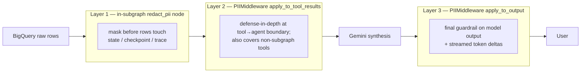

| Layer | Where | Purpose |
|---|---|---|
| 1 | `redact_pii` node (post-`execute_bq`) | Earliest point; prevents raw PII landing in checkpoints / traces (FR-1.3.1a) |
| 2 | Middleware `apply_to_tool_results` | Defense-in-depth + covers tools outside the subgraph |
| 3 | Middleware `apply_to_output` (incl. streaming) | Final user-facing guardrail incl. hallucinated PII (FR-1.3.1b) |

All three share one detector definition set (built-in `email`; custom regex for `phone`) so behavior and metrics are consistent.

### 8.2 Structural containment (malicious input — FR-1.3.2/1.3.3)

The blast radius of any prompt injection is bounded by architecture, not by detection:

| Attack | Structural wall |
|---|---|
| Destructive SQL | Read-only BigQuery connection + `validate_sql` (SELECT-only, allowed tables) |
| PII exfiltration | 3-layer redaction — raw values never reach the LLM or the user |
| State mutation | HITL gate on the only mutating tools |
| Arbitrary actions | Tool allow-listing — the agent can only call the tools it was given |
| Privileged config / GDPR | Not in the agent's tool surface at all (admin plane only) |
| Runaway abuse | Per-user budget + call-limit middleware |

A dedicated prompt-injection classifier is **deferred** (see §20) — the population is authenticated internal employees and the consequences of injection are already structurally contained. Behavioral OOS handling is via the system prompt (decline + redirect) plus a structured response schema.

---

## 9. High-Stakes Oversight (R3)

### 9.1 Report deletion (UC-05)

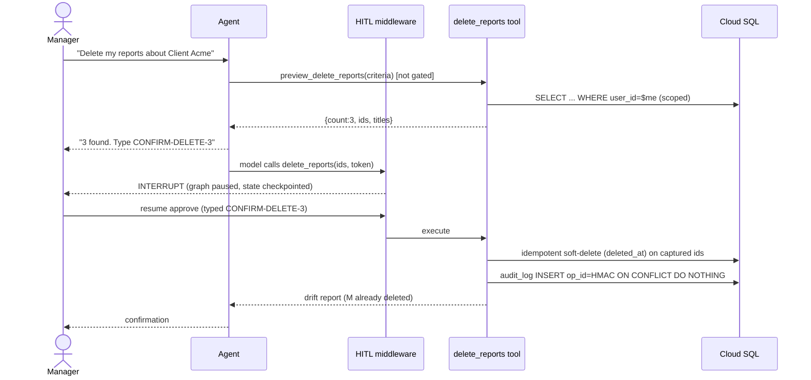

- Deletion is **two tools**: `preview_delete_reports` (read-only, not gated) captures the count-bound id set; `delete_reports` is HITL-gated with `allowed_decisions=["approve","reject"]` (**edit forbidden** — editing destructive args can make the model re-evaluate and re-execute).
- Ownership scoping (`user_id`) is enforced **inside** the tool, not via an LLM argument (FR-1.4.5).
- Idempotency: `op_id = HMAC(user, thread, ids)` + `ON CONFLICT DO NOTHING` makes double-resume safe. Soft-delete on captured ids is drift-safe.

### 9.2 GDPR cascade (UC-11 / FR-1.4.6)

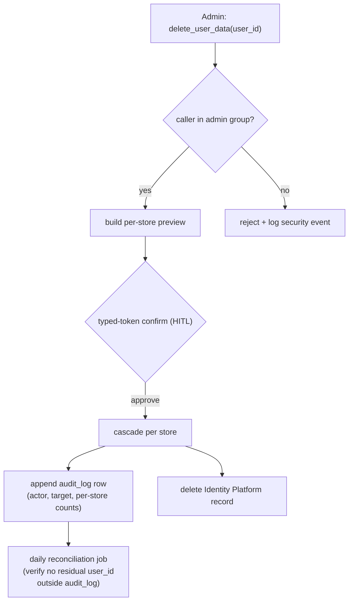

Per-store semantics follow §7.2 (soft-delete / hard-delete / anonymize / never-delete). The cascade spans our stores **and** Identity Platform. It is idempotent and re-runnable; the reconciliation job (driven by `audit_log` deletion rows) catches any partial failure or a newly-added store that wasn't wired into the cascade.

---

## 10. Resilience & Error Handling (R5)

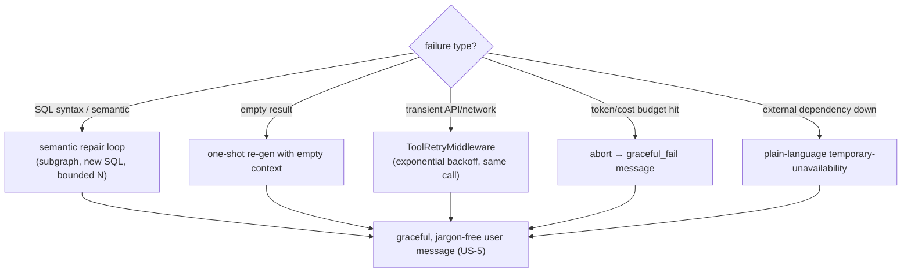

| Failure | Handling | Requirement |
|---|---|---|
| SQL syntax/semantic error | Subgraph `repair_sql`, bounded by N + token budget | FR-1.7.1, FR-1.7.2 |
| Empty result | `repair_empty` one-shot, then graceful "no data" | FR-1.7.3 |
| Per-request budget exceeded | Abort self-correction → graceful failure | FR-1.7.4 |
| Transient LLM/BQ/network | `ToolRetryMiddleware` exponential backoff | FR-1.7.5 |
| Observability sink down | Non-blocking, fail-silent (never affects user) | FR-1.7.5 |
| LLM provider failover | `ModelFallbackMiddleware` — **deferred** ("where configured") | FR-1.7.5, §20 |
| Embedding-call transient failure | `ToolRetryMiddleware` on `query_data` (fallback middleware wraps chat, not embeddings) | FR-1.7.5 |

---

## 11. Learning Loop (R4)

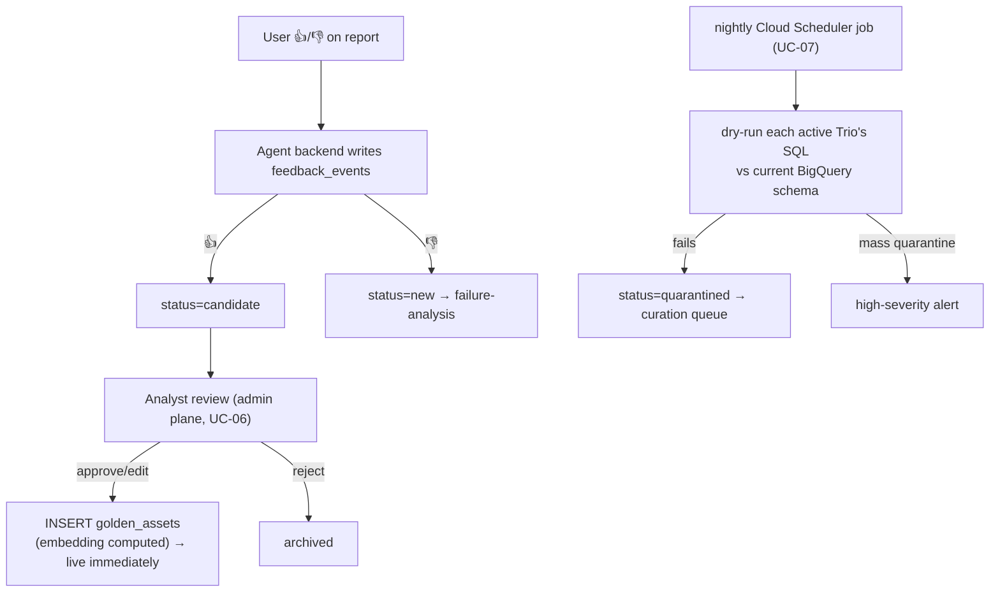

- Feedback is written by **our backend** to our Postgres (source of truth for the learning loop), and a fail-silent copy is annotated to the LangSmith trace. LangSmith is a sink, never load-bearing — an outage cannot break the loop.
- **No auto-promotion** (FR-1.5.7): positive feedback only queues a candidate; promotion requires an explicit analyst action in the admin plane.
- A new Trio embedding is computed from the question and becomes available to retrieval immediately.
- Schema-drift quarantine keeps stale Trios out of the few-shot pool; mass quarantine raises an alert.

---

## 12. Persona Management (R8 / UC-08)

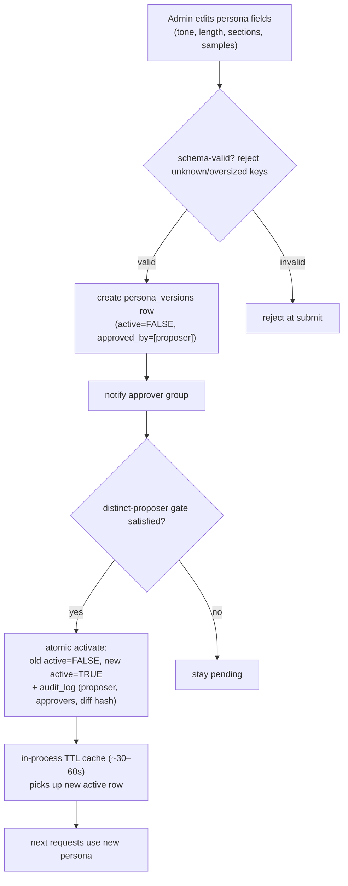

- **Structured payload**, schema-validated at submit time in the admin API (reject unknown keys / oversized fields — prevents smuggling injection payloads).
- **Governance flag** `PERSONA_REQUIRE_DISTINCT_PROPOSER` (boolean, recommended default `true`): when true, activation needs ≥1 approver who is not the proposer (four-eyes, minimum two humans); when false, solo activation (explicit opt-in for tiny orgs). A future count flag can raise the bar without breaking this floor.
- **Propagation** via in-process TTL cache (~30–60s) — persona changes are rare (weekly), reads are per-request, so caching with a short staleness window beats per-request DB reads and avoids a push bus. Multiple Cloud Run instances may briefly serve different versions within the TTL; harmless for tone.
- The agent reads persona from the cache via the dynamic-prompt middleware (structural injection on every request).

---

## 13. Cost & Budget Controls (FR-1.7.6, FR-1.7.4)

One `cost_attribution` table (one row per request: LLM tokens, embedding tokens, BigQuery bytes-billed, derived `cost_usd`) feeds four mechanisms:

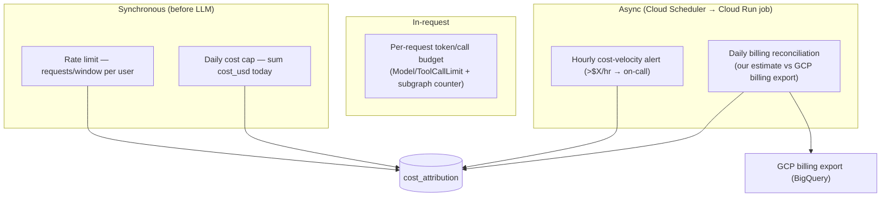

- **Cost is computed from two hooks:** `wrap_model_call` (LLM + embedding tokens) and `wrap_tool_call` (BigQuery `bytes_billed` returned by `query_data`). Single-hook accounting would undercount.
- Rate-limit and daily-cap counters read from Postgres `cost_attribution` — one source of truth, no new infrastructure. Sufficient for internal scale (tens–hundreds of users, low QPS).
- The daily cap is checked against *prior* accumulated spend (current request cost is known only at completion), so a user at the cap may overshoot by one request — acceptable; the hourly alert catches genuine runaway loops fast.
- Over-cap / over-rate requests get a friendly message **without invoking the LLM** (E-1.6).

---

## 14. Observability (R7)

Three complementary, non-overlapping channels:

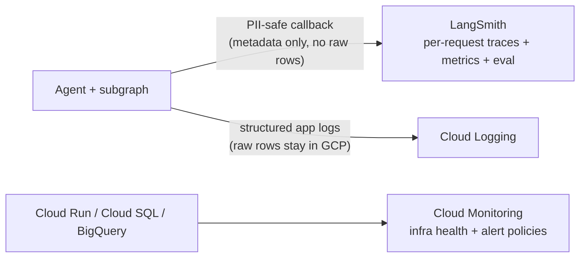

| Channel | Holds | Serves |
|---|---|---|
| **LangSmith** (SaaS) | Per-request trace tree: model calls, retrieved Trio ids, generated SQL, validation outcome, repair attempts, masking events, token/cost — **never raw PII rows** | FR-1.8.4, UC-09 deep-dive |
| **Cloud Logging** | Structured app logs incl. raw result data (restricted access, stays inside GCP) | FR-1.8.3 |
| **Cloud Monitoring** | Infra metrics + alert policies (DB saturation, error rate, BQ quota) → PagerDuty/Slack | NFR-2.6.2 |

**PII-safe instrumentation:** the LangSmith callback sends agent topology, timings, ids, SQL, and costs — not BigQuery row values. Cross-reference by `trace_id` into Cloud Logging (inside GCP) for the actual data when debugging. LangSmith is configured fail-silent (an outage never blocks a user request).

---

## 15. Evaluation & QA (R6)

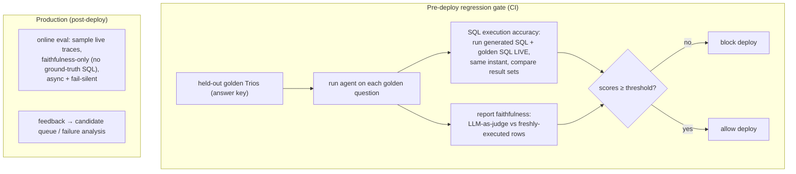

- **Held-out** Trios are the answer key; never used for runtime retrieval (no test leakage).
- **Execution accuracy** (not string match): both the generated SQL and the analyst's golden SQL are executed **live at the same instant**, and their result sets compared. This is robust to ever-changing data (both queries see the same current snapshot) and to the fact that many different SQL strings are correct. The reference is the **analyst's** golden SQL, not a previous version's output.
- **Faithfulness** is judged against freshly-executed rows, never against the stale golden report text.
- Below-threshold scores **block deployment** (FR-1.9.4).
- **Online eval** samples live traffic for faithfulness only (no ground-truth SQL exists for novel questions); it catches drift the fixed set cannot.

---

## 16. Admin Plane

A **separate service** (own Cloud Run, same Cloud SQL), distinct from the chat agent. These operations are structured, not conversational, and are gated by IAM role rather than exposed as agent tools.

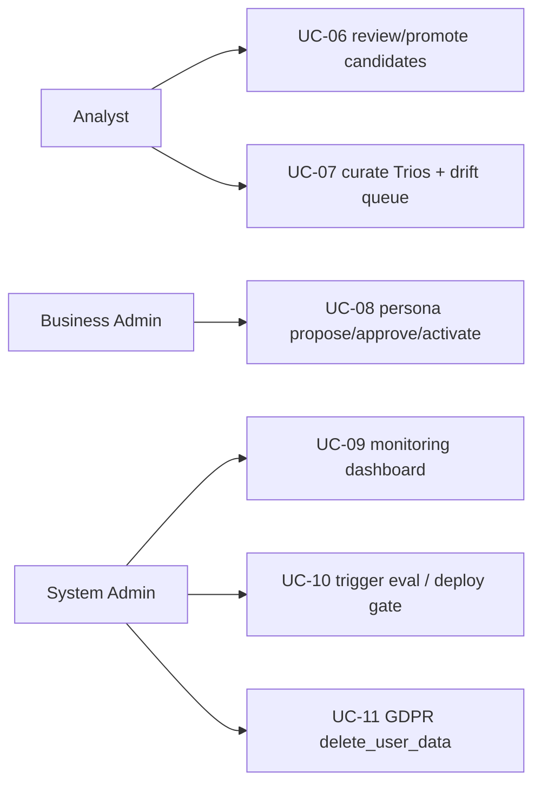

Rationale: these are not chat interactions; different actors with different IAM roles; and the most privileged operations (persona activation, GDPR cascade) must be **unreachable from the chat agent's tool surface** by construction.

---

## 17. Security & Networking Posture

Two walls protect customer and employee data:

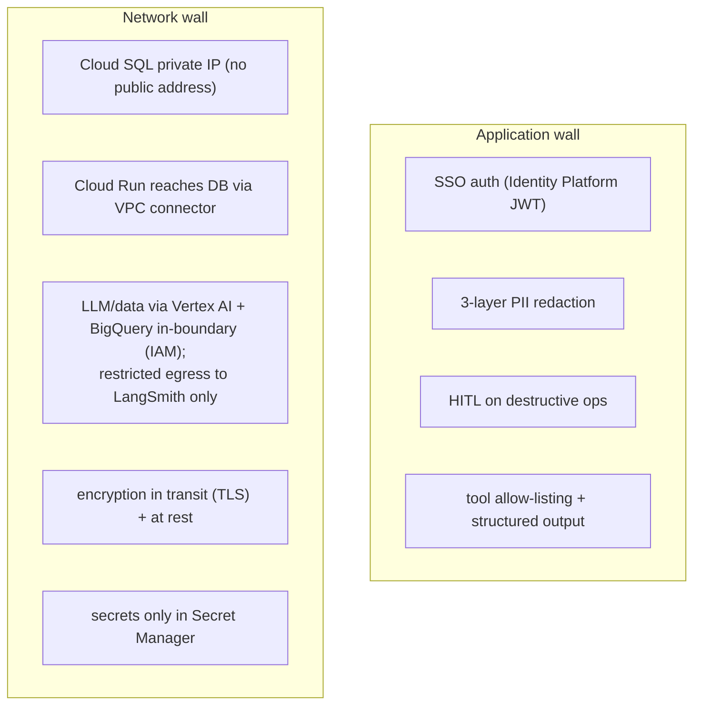

- **Cloud SQL: private IP only** — reachable solely from our service inside the VPC; no internet door even with stolen credentials.
- **Cloud Run: authenticated only** — every request carries a valid SSO JWT; not publicly open.
- **LLM and source data stay in-boundary** — Vertex AI (Gemini) and BigQuery are GCP services reached via IAM / Application Default Credentials, not an external API key. The LLM call is an IAM-authenticated, in-boundary call — consistent with the rest of the posture, not an exception to it. (Vertex's regional endpoints also let us pin data-processing residency for GDPR.)
- **Egress allow-listed** — the only external destination is LangSmith; a compromised agent cannot exfiltrate to arbitrary destinations.
- **Encryption** in transit and at rest (NFR-2.2.1) — largely GCP defaults, confirmed enabled.
- **Read-only DB connection** to BigQuery (C-1, NFR-2.2.2).

---

## 18. Deployment & Operations

| Concern | Choice |
|---|---|
| Compute | Cloud Run (stateless, scale-to-zero, streaming HTTP, native IAM) |
| State | Cloud SQL for PostgreSQL + pgvector (private IP) |
| Scheduled work | Cloud Scheduler → Cloud Run Jobs: nightly Trio drift detection (FR-1.5.6), daily GDPR reconciliation (FR-1.4.6), hourly cost-velocity alert + daily billing reconciliation (FR-1.7.6) |
| Secrets | Secret Manager (DB creds, HMAC key) |
| Identity | Identity Platform (SSO; sole PII store); admin ops gated by group claim |
| Source data | BigQuery `thelook_ecommerce`, read-only |
| LLM / embeddings | Gemini 3.5 Flash / gemini-embedding-001 via **Vertex AI backend** (`ChatGoogleGenerativeAI` / `GoogleGenerativeAIEmbeddings`, IAM/ADC auth) — same LangChain classes, Vertex backend selected by GCP project config |

---

## 19. Requirements Traceability Matrix

| Requirement | Satisfied by |
|---|---|
| **brief R1 / FR-1.2.x** Hybrid intelligence | §5 analysis subgraph (Trio retrieval as few-shot), §11 learning loop |
| **brief R2 / FR-1.3.x** Safety & PII | §8 three-layer redaction + structural containment |
| **brief R3 / FR-1.4.x** High-stakes oversight | §9 HITL delete + GDPR cascade |
| **brief R4 / FR-1.5.x** Learning loop | §11 feedback → candidate → analyst promote; drift detection |
| **brief R5 / FR-1.7.x** Resilience | §10 repair loop, retries, budgets, graceful degradation |
| **brief R6 / FR-1.9.x** Quality assurance | §15 regression gate (execution accuracy + faithfulness) + online eval |
| **brief R7 / FR-1.8.x** Observability | §14 LangSmith + Cloud Logging + Cloud Monitoring |
| **brief R8 / FR-1.6.x** Persona / personalization | §12 persona governance + TTL propagation; prefs in LangGraph store |
| **FR-1.1.x** NL interface / multi-turn | §4 agent + checkpointer; §12 summarization |
| **FR-1.2.5** Schema discovery | §5 `describe_schema` tool (no SQL) |
| **NFR-2.1** Performance | §5 small-k retrieval, schema-discovery short-circuit; §13 budgets |
| **NFR-2.2** Security | §17 posture; §8 PII; read-only DB |
| **NFR-2.4** Reliability | §10 resilience; Cloud Run + Cloud SQL HA |
| **NFR-2.6** Observability | §14 channels + alerting |
| **UC-01–05** Manager flows | §4–6, §9 |
| **UC-06–11** Analyst/Admin flows | §11, §12, §15, §16, §9.2 |

---

## 20. Deferred Decisions & Scale-Triggers

| Deferred | Current posture | Trigger to add |
|---|---|---|
| Dedicated prompt-injection classifier | Structural containment + prompt-level decline | Exposure beyond authenticated internal SSO (e.g., customer-facing) |
| LLM provider failover (`ModelFallbackMiddleware`) | Single-provider (Gemini); "where configured" clause met | Repeated Gemini outages or an SLA requiring multi-provider |
| Reranker on retrieval | Top-k pgvector, similarity floor | Large Trio corpus where top-k precision degrades |
| Glossary / schema-chunk retrieval stores | Trios-only + static schema description | Large production schema or established jargon dictionary |
| Redis (Memorystore) for rate/budget counters | Postgres `cost_attribution` | Public exposure or ~thousands of QPS |
| Cloud Monitoring per-user cost metrics | Scheduled-job alert over Postgres | Large user count making metric cardinality worthwhile |
| Multi-approver count (>1 distinct) for persona | Single distinct-proposer boolean | Larger org governance needs |
| Cryptographic hash-chain audit log | INSERT-only grants + retention-locked export | Adversarial/legal-evidence threat model |
| Retrieval pattern-distillation | Embed full standalone question | Specific values drowning out analytical pattern in retrieval |

---
