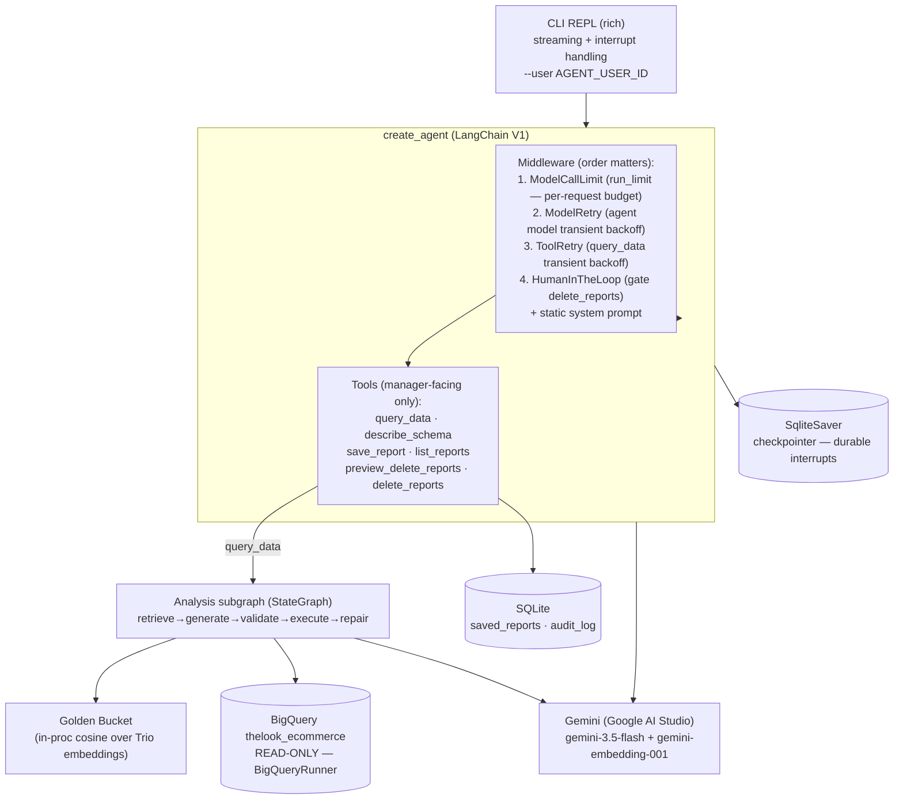
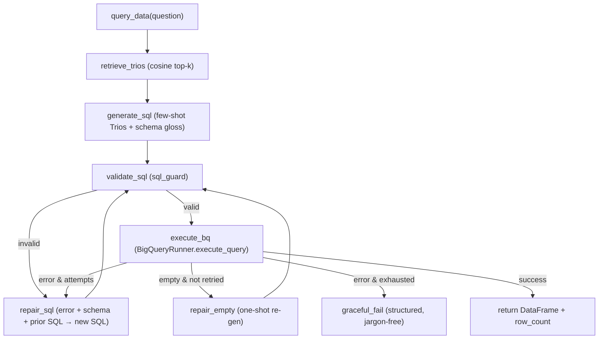

# Retail Data Agent — Prototype Design

**Date:** 2026-05-30
**Status:** Approved for implementation — API surface verified against live LangChain V1 docs (2026-05-30)
**Source of truth chain:** `design/00_Brief.md` → `01_Project_Vision.md` → `02_Requirements.md` → `03_Use_Case_Diagrams.md` → `04_System_Design.md` (HLD). This prototype is a deliberate, runnable *subset* of the HLD.

---

## 1. Overview & Scope

A single-process **CLI chat agent** for non-technical retail managers. A manager types a natural-language question; the agent retrieves analyst-curated "Golden Trios" (Question → SQL → Report) as few-shot examples, generates SQL, runs it **read-only** against `bigquery-public-data.thelook_ecommerce`, and synthesizes a business-language report. It also manages a personal saved-reports library with a human-gated delete flow.

The prototype demonstrates **two of the brief's five optional requirements structurally** (not via LLM discretion):

- **R5 — Resilience & Self-Correction:** a sealed analysis subgraph with a bounded SQL repair loop, empty-result re-generation, transient retry, and graceful jargon-free failure.
- **R3 — High-Stakes Oversight:** saved-reports deletion gated by a human-in-the-loop interrupt with a count-bound confirmation token, ownership scoping, idempotency, and an audit log.

It also realizes **R1 — Hybrid Intelligence** (the Golden Bucket) as core, since that is the thematic heart of the assignment, and answers schema-discovery questions (brief "Expected Agent Capabilities") via a no-SQL `describe_schema` tool.

### 1.1 Production → prototype substitutions

| HLD (production) | Prototype |
|---|---|
| Vertex AI (Gemini, IAM/ADC) | **Google AI Studio API** (`GOOGLE_API_KEY`) via `langchain-google-genai` 4.x — chat `gemini-3.5-flash`, embeddings `gemini-embedding-001` |
| Cloud SQL Postgres + pgvector | **SQLite** (operational state) + **in-process numpy cosine** (Trio vectors) |
| PostgresSaver / PostgresStore | **SqliteSaver** checkpointer (durable interrupts); no long-term store |
| Cloud Run, Identity Platform, admin plane, Cloud Scheduler jobs | **omitted** |
| LangSmith / Langfuse | **omitted** (thin local structured logging only, not claimed as the Observability requirement) |
| BigQuery `thelook_ecommerce` (read-only) | **unchanged** — the mandated source, accessed via the provided `BigQueryRunner` |

### 1.2 Framework decision

Build on **LangChain V1** (`from langchain.agents import create_agent`) with an ordered **middleware stack**, and the SQL lifecycle as a **sealed LangGraph `StateGraph` subgraph** behind one tool. This was chosen over a LangGraph-native build so the two chosen requirements land on the HLD's two structural ideas: HITL = middleware, Resilience = the bounded subgraph. `langchain>=1.0` is added to the mandated dependency floor (the user's pinned list was explicitly "some of" the requirements). **Caveat:** `langchain` 1.x, `langchain-core` ≥1.0, and `langchain-google-genai` must resolve together; pin exact compatible versions at install time and record them in `requirements.txt`.

**API surface verified against live LangChain V1 docs (2026-05-30).** All middleware (`HumanInTheLoopMiddleware`, `ModelCallLimitMiddleware`, `ToolCallLimitMiddleware`, `ToolRetryMiddleware`, `ModelRetryMiddleware`, `PIIMiddleware`) live under `langchain.agents.middleware`; the HITL `allowed_decisions=["approve","reject"]` pattern and the `Command(resume={"decisions":[…]})` / `version="v2"` resume contract match the docs' canonical `execute_sql` example. Note: `create_agent`'s *agent* state must be a `TypedDict` (subclass `langchain.agents.AgentState`) — Pydantic/dataclass states are unsupported in V1. This does not affect the analysis subgraph, which is a **separate** `StateGraph` with its own `TypedDict` state.

---

## 2. Architecture



**Tool-surface containment.** The agent holds only manager-facing tools. Its one destructive tool (`delete_reports`) is HITL-gated. No admin/persona/GDPR operations exist in the tool surface — a deliberate blast-radius boundary carried over from the HLD.

---

## 3. Components (file map)

```
prototype/
  README.md              # setup, two-auth explanation, example run, requirement mapping, arch diagram
  requirements.txt
  .env.example
  retail_agent/
    __init__.py
    config.py            # env loading + constants (model names, MAX_SQL_ATTEMPTS, MAX_RESULT_ROWS, user id)
    cli.py               # rich REPL: stream responses, detect interrupt, capture confirm token, resume
    agent.py             # create_agent assembly: model, tools, middleware stack, system prompt
    subgraph.py          # analysis StateGraph (retrieve→generate→validate→execute→repair) — Resilience
    tools.py             # query_data, describe_schema, save_report, list_reports,
                         #   preview_delete_reports, delete_reports
    golden_bucket.py     # load seed Trios, embed (cached), cosine top-k retrieval
    bigquery_client.py   # the provided BigQueryRunner (verbatim) + exception classifier (transient vs semantic)
    sql_guard.py         # sqlglot SELECT-only / allowed-tables / LIMIT enforcement
    storage.py           # SQLite: schema init + saved_reports & audit_log helpers
    schema_catalog.py    # business-language gloss over live get_table_schema()
    prompts.py           # system prompt, sql-generation prompt, repair prompt
    logging_setup.py     # local structured logging (dev hygiene)
  data/
    golden_trios.json    # ~8 seed Trios
    embeddings_cache.json # generated on first run (gitignored)
  tests/
    test_sql_guard.py
    test_subgraph_repair.py
    test_delete_scoping.py
```

Each unit has one purpose and a narrow interface: `sql_guard.validate(sql) -> ValidatedSQL | raises`; `golden_bucket.retrieve(question, k) -> list[Trio]`; `storage.preview_deletable(user_id, criteria) -> {ids, titles, count}`; `bigquery_client.run(sql) -> DataFrame`.

---

## 4. Analysis Subgraph — Resilience (R5)

`query_data(question)` runs one compiled `StateGraph`. Retrieval is structurally first (the agent cannot skip it). Generation and repair share one logic site (`repair_sql` = "generate again, now with the error in context").



**State (TypedDict):** `{question, trios, sql, attempts, max_attempts, errors[], rows (DataFrame|None), row_count, empty_retried, tokens_used}`.

**Bounds & guarantees:**
- `max_attempts` = `MAX_SQL_ATTEMPTS` (default 3). On exhaustion → `graceful_fail`.
- Per-request budget enforced by `ModelCallLimitMiddleware(run_limit=N)` (per-invocation model-call cap) — independent backstop on cost (FR-1.7.4). Optionally `ToolCallLimitMiddleware(tool_name="query_data", run_limit=…, exit_behavior="end")` bounds subgraph re-entries.
- **Semantic repair vs transient retry — cleanly separated by exception classification.** `execute_bq` classifies each exception: a *semantic* error (bad SQL / query error) routes to `repair_sql` inside the subgraph (new SQL each attempt); a *transient* error (timeout, 5xx, connection) is **re-raised** so the built-in `ToolRetryMiddleware` retries the whole `query_data` tool with exponential backoff. The agent's own model calls are covered by `ModelRetryMiddleware`. No hand-rolled retry code — a flaky network is never mistaken for bad SQL.
- `repair_empty` runs exactly once; if still empty → graceful "no matching data, try refining" message (FR-1.7.3).
- `graceful_fail` returns a plain-language message with a refinement suggestion — no SQL, stack traces, or internal ids (US-5).

---

## 5. High-Stakes Oversight — HITL delete (R3)

Two tools mirror UC-05:

- `preview_delete_reports(criteria)` — **read-only, not gated.** Scopes to the current `user_id` *inside the tool* (ownership is never an LLM argument, FR-1.4.5). Returns `{count, ids, titles}` and stashes the captured id list.
- `delete_reports(ids, token)` — **HITL-gated** via `HumanInTheLoopMiddleware(interrupt_on={"delete_reports": {"allowed_decisions": ["approve", "reject"]}})`. Edit is forbidden (editing destructive args could make the model re-evaluate and re-execute). *This mirrors the LangChain docs' canonical `execute_sql` example verbatim.*

**Verified resume contract.** The interrupt fires when the model *proposes* `delete_reports` (before execution). The agent invocation runs with `version="v2"`; the interrupt payload (`result.interrupts` / streamed `__interrupt__`) carries the proposed tool name + args, so the CLI renders the preview directly from it. The CLI resumes with `Command(resume={"decisions": [{"type": "approve"}]})` (or `"reject"`), reusing the same `thread_id`. A checkpointer is mandatory for this.

**`CONFIRM-DELETE-N` is a CLI-layer ritual on top of approve/reject** (not a separate mechanism): the CLI shows the preview from the interrupt, reads the typed token, and maps a correct `CONFIRM-DELETE-N` → `{"type": "approve"}`, anything else → `{"type": "reject"}`. The tool *still* independently re-validates `token == CONFIRM-DELETE-{count}`, ownership, and idempotency on execution — defense in depth, never trusting the LLM-supplied arg.

```mermaid
sequenceDiagram
    actor U as Manager (CLI)
    participant A as Agent
    participant H as HITL middleware
    participant T as delete_reports tool
    participant DB as SQLite

    U->>A: "Delete my reports about Acme"
    A->>T: preview_delete_reports(criteria)  [not gated]
    T->>DB: SELECT ... WHERE user_id=$me AND deleted_at IS NULL
    T-->>A: {count:3, ids, titles}
    A-->>U: "3 found. Type CONFIRM-DELETE-3"
    A->>H: model calls delete_reports(ids, token)
    H-->>U: INTERRUPT (graph paused, checkpointed)
    U->>H: types token; CLI resumes approve iff token == CONFIRM-DELETE-3
    H->>T: execute
    T->>DB: UPDATE saved_reports SET deleted_at=now\n   WHERE id IN(ids) AND user_id=$me AND deleted_at IS NULL
    T->>DB: INSERT OR IGNORE audit_log (op_id = HMAC(user, thread, ids))
    T-->>A: drift report (M of N already deleted)
    A-->>U: confirmation
```

**Invariants:**
- Ownership scoping enforced in SQL (`AND user_id = ?`), not by the model.
- Idempotency: `op_id = HMAC(user_id, thread_id, sorted(ids))` + `INSERT OR IGNORE` makes a double-resume safe.
- Soft-delete (`deleted_at`) on the *captured* ids → drift-safe even if data shifted during the interrupt; reports never hard-deleted.
- `AGENT_USER_ID` is a CLI flag/env so ownership scoping is demonstrable (`manager_a` cannot delete `manager_b`'s reports).
- Durable interrupt: state is checkpointed by `SqliteSaver`, so the pause survives even a process restart.

*PII masking (R2) is intentionally out of scope.* The add-back is a single built-in-middleware line rather than a custom node: `PIIMiddleware("email", strategy="redact", apply_to_output=True)` plus a custom regex detector for `phone` (streamed-output redaction needs `langchain>=1.3.2`). The spec notes this exact one-liner where it would slot into the middleware stack.

---

## 6. Golden Bucket — Hybrid Intelligence (R1)

- ~8 seed Trios in `data/golden_trios.json`, authored to cover the brief's Expected Agent Capabilities: top customers / total spend, product performance, monthly & up-to-date revenue, regional/store comparison, and a schema-style example.
- On first run, each Trio question is embedded with `gemini-embedding-001` (stable GA text embedder; `gemini-embedding-2` is the newer upgrade path) and cached to `data/embeddings_cache.json` (avoids re-embedding every run and conserves the free-tier quota). The cache stores the model id so a model change forces a clean re-embed (the two embedding spaces are incompatible).
- `retrieve_trios` embeds the live question, computes **cosine similarity** (numpy) against cached Trio vectors, returns top-k (k=3). These become few-shot exemplars in the `generate_sql` prompt, steering both SQL structure and report style.
- Structurally the first subgraph node → retrieval cannot be skipped (closes the "agent skips retrieval → quality collapse" failure mode).

---

## 7. BigQuery Integration

The provided `BigQueryRunner` class is used **verbatim** in `bigquery_client.py`:
- `execute_query(sql) -> pandas.DataFrame` — execution path (requires `pandas` + `db-dtypes` for `to_dataframe()`).
- `get_table_schema(table_name) -> list[dict]` — powers `describe_schema` and the schema gloss fed into SQL generation.

Because `execute_query` has no built-in guard, **`sql_guard.validate()` runs before every execution** (sqlglot parse → reject any non-`SELECT`/DML/DDL, restrict FROM/JOIN targets to `orders`, `order_items`, `products`, `users`, and enforce/inject a `LIMIT MAX_RESULT_ROWS`). `bigquery_client.py` adds a thin **exception classifier** around `execute_query`: *semantic* errors (query/syntax) surface to the subgraph's `repair_sql`; *transient* errors (timeout, 5xx, connection) re-raise unchanged so the agent-level `ToolRetryMiddleware` retries the `query_data` tool with backoff. No custom retry/`tenacity` code, and no dry-run pre-check — the bounded repair loop handles real execution errors, which is the Resilience demonstration.

**Two distinct Google auths** (README states this prominently):
1. `GOOGLE_API_KEY` — Google AI Studio, for Gemini chat + embeddings.
2. Application Default Credentials (`gcloud auth application-default login`) **plus a billable GCP project** (`GOOGLE_CLOUD_PROJECT`) — for BigQuery compute (free 1 TB/month tier). The dataset is public but the *query* runs in your project.

---

## 8. Data Layer (SQLite)

```sql
CREATE TABLE saved_reports (
  id INTEGER PRIMARY KEY AUTOINCREMENT,
  user_id    TEXT NOT NULL,
  title      TEXT NOT NULL,
  body       TEXT NOT NULL,
  created_at TEXT NOT NULL,
  deleted_at TEXT            -- NULL = live; soft-delete only
);
CREATE TABLE audit_log (
  op_id      TEXT PRIMARY KEY,   -- HMAC(user_id, thread_id, sorted ids)
  actor      TEXT NOT NULL,
  action     TEXT NOT NULL,      -- 'delete_reports'
  target_ids TEXT NOT NULL,      -- JSON array
  counts     TEXT NOT NULL,      -- JSON {requested, deleted, already_gone}
  ts         TEXT NOT NULL
);
```

The LangGraph `SqliteSaver` checkpointer uses its own SQLite file (`data/checkpoints.sqlite`). Both DB files are gitignored.

---

## 9. CLI UX

`rich`-based REPL launched with `python -m retail_agent.cli --user manager_a`. Sync streaming via `agent.stream(input, config={"configurable": {"thread_id": …}}, stream_mode="updates", version="v2")` (the `version="v2"` flag is **required** for the interrupt contract; sync `SqliteSaver` keeps the CLI free of asyncio — `InMemorySaver` is the trivial swap if durable interrupts aren't wanted). On a tool interrupt, the CLI renders the deletion preview from the interrupt payload, prompts for the confirmation token, and resumes with `Command(resume={"decisions": [{"type": "approve"}]})` (or `"reject"`) on the same `thread_id`. Slash helpers: `/help`, `/exit`. Example session:

```
you> what were the top 5 products by revenue last month?
agent> [retrieves 3 Trios] [generates SQL] [executes] 
       Here are last month's top 5 products by revenue: ...
you> save that as "Top products May"
agent> Saved report #4 to your library.
you> delete my reports about top products
agent> I found 1 report owned by you: #4 "Top products May".
       To confirm deletion, type: CONFIRM-DELETE-1
you> CONFIRM-DELETE-1
agent> Deleted 1 report. (0 were already gone.)
```

---

## 10. Configuration & Dependencies

**`.env.example`:**
```
GOOGLE_API_KEY=            # Google AI Studio (Gemini chat + embeddings)
GOOGLE_CLOUD_PROJECT=      # billable GCP project for BigQuery compute
GEMINI_MODEL=gemini-3.5-flash
EMBED_MODEL=gemini-embedding-001
AGENT_USER_ID=manager_a
MAX_SQL_ATTEMPTS=3
MAX_RESULT_ROWS=1000
```

**`requirements.txt`** — mandated floor plus prototype additions:
```
# mandated by user
langgraph>=0.2.0
langchain-google-genai>=1.0.0    # resolves to 4.x — required for gemini-3.5 + consolidated google-genai SDK
google-cloud-bigquery>=3.13.0
pandas>=2.0.0
python-dotenv>=1.0.0
langchain-core>=0.3.0
db-dtypes==1.2.0
# added for this build (pin exact compatible versions at install)
langchain>=1.0            # create_agent + middleware (V1): HITL, ModelCallLimit, ModelRetry, ToolRetry
langgraph-checkpoint-sqlite   # SqliteSaver — durable interrupts
sqlglot                   # SELECT-only / allowed-tables guard
numpy                     # in-process cosine over Trio embeddings
rich                      # CLI REPL
pytest                    # dev
```

---

## 11. Error-Handling Matrix

| Failure | Handling | Requirement |
|---|---|---|
| Invalid / non-SELECT SQL | `sql_guard` rejects → `repair_sql` | FR-1.7.1 |
| SQL execution error | `repair_sql`, bounded by N + call budget | FR-1.7.2 |
| Empty result | `repair_empty` one-shot → graceful "no data" | FR-1.7.3 |
| Per-request budget hit | `ModelCallLimitMiddleware(run_limit=N)` → graceful stop | FR-1.7.4 |
| Transient BigQuery error | classifier re-raises → `ToolRetryMiddleware` backoff on `query_data` | FR-1.7.5 |
| Transient Gemini (agent model) error | `ModelRetryMiddleware` backoff | FR-1.7.5 |
| Missing/invalid credentials | Clear startup message naming which of the two auths failed | NFR-2.3.2 |
| Out-of-scope / off-topic question | System-prompt decline + redirect | FR-1.3.3 |

---

## 12. Testing Plan

- `test_sql_guard.py` — rejects `DELETE`/`UPDATE`/`DROP`, rejects disallowed tables, injects/keeps `LIMIT`, accepts a valid SELECT over allowed tables.
- `test_subgraph_repair.py` — with a mocked BigQuery layer: bad SQL → repair → success; persistent error → `graceful_fail` within `max_attempts`; empty result → one re-gen then graceful "no data".
- `test_delete_scoping.py` — `manager_a` cannot preview/delete `manager_b`'s rows; double-resume of the same `op_id` deletes once (idempotency); soft-delete sets `deleted_at` and excludes the row from future previews.

These mock Gemini and BigQuery so the suite runs offline and free.

---

## 13. Out of Scope (explicit)

PII masking (R2), persona governance (R8), user preferences, feedback/learning loop & analyst curation (R4), admin plane, pre-deployment evals (R6), Observability dashboards/LangSmith (R7), authentication/SSO, GDPR cascade, Cloud infra, Docker. Each maps to a clearly-labeled section of the HLD and is called out in the README as "designed in HLD, deferred in prototype."

---

## 14. Definition of Done

1. `pip install -r requirements.txt` then `python -m retail_agent.cli --user manager_a` runs on a clean machine given the two credentials.
2. A managerial NL question returns a grounded, business-language report from live BigQuery data, demonstrably using retrieved Trios.
3. A deliberately hard/ambiguous question exercises the repair loop and (when unrecoverable) returns a graceful failure — no stack trace.
4. The save → delete-with-`CONFIRM-DELETE-N` flow works, scoped to the user, idempotent, audit-logged.
5. `pytest` passes offline.
6. README documents setup, the two-auth model, an example run, and how R1/R3/R5 are solved + what is deferred from the HLD and why.
```