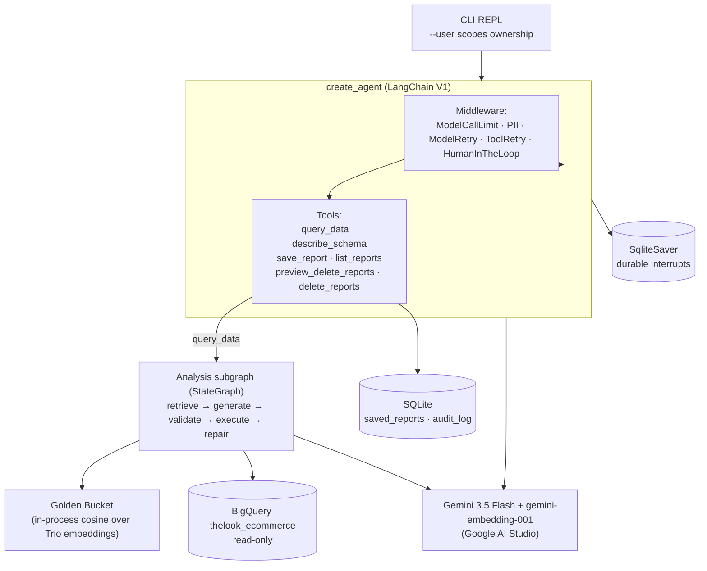

# Retail data analysis chat assistant (prototype)

A command-line agent that lets a non-technical store or regional manager ask questions about sales in plain English and get a written answer back. Under the hood it looks up similar questions that analysts have answered before, writes SQL, runs it read-only against the public `bigquery-public-data.thelook_ecommerce` dataset, and turns the rows into a short report. It also keeps a small library of saved reports, and deleting one asks for confirmation first.

This prototype is a slice of a larger production design. The full high-level design lives in [`../design/04_System_Design.md`](../design/04_System_Design.md); the decisions behind what made it into this prototype (and what didn't) are in [`../docs/superpowers/specs/2026-05-30-retail-data-agent-prototype-design.md`](../docs/superpowers/specs/2026-05-30-retail-data-agent-prototype-design.md).

## What you can ask

- Customer behaviour: "Who are our top customers by total spend?"
- Product and brand performance: "Which brands generate the most revenue?"
- Time-based metrics: "What was our monthly revenue over the last year?"
- Comparisons: "Compare revenue between the Jeans and Sweaters categories."
- The data itself: "What can I ask about?" (answered without running a query)

Report management is conversational too: "save that as 'Q2 review'", "list my reports", "delete my reports about products".

## Requirements covered

The brief asks the prototype to implement at least two of its five optional requirements. This one does two of them structurally (enforced by the architecture, not left to the model to remember), plus the hybrid-intelligence theme that runs through the whole assignment.

| Requirement | How it is handled | Where |
|---|---|---|
| R1 Hybrid intelligence | Analyst "Golden Trios" (question → SQL → report) are embedded once and retrieved by cosine similarity to seed SQL generation with worked examples | `golden_bucket.py`, `data/golden_trios.json` |
| R2 Safety and PII | `PIIMiddleware` redacts emails (built-in) and phone numbers (regex) in tool results and in the final answer, so contact data never reaches the user even if a query selects it | `agent.py` |
| R3 High-stakes oversight | Deleting reports pauses on a human-in-the-loop interrupt with a `CONFIRM-DELETE-N` token; ownership is scoped in SQL, deletes are idempotent soft-deletes, and each one is written to an audit log | `tools.py`, `storage.py` |
| R5 Resilience | A sealed subgraph runs the SQL lifecycle with a bounded repair loop, an empty-result retry, transient-error backoff, and a plain-language failure message when it gives up | `subgraph.py`, `sql_guard.py` |

Schema-discovery questions are answered from a static catalog with no SQL execution (`schema_catalog.py`), which the brief lists under expected capabilities.

## Architecture



Three ideas hold the design together:

- Cross-cutting policy is middleware. The budget cap, PII redaction, retries, and the human gate run no matter which tool the model picks. The model cannot skip them.
- The one workflow the model must not improvise, the SQL repair loop, is a sealed `StateGraph` behind a single tool. Retrieval is its first node, so the model can't answer without consulting the Golden Trios.
- Everything else is a plain tool. The only destructive one, `delete_reports`, is gated. Admin and GDPR operations are simply absent from the tool list, so a confused or manipulated model has no way to reach them.

## Why these technologies

- Gemini 3.5 Flash for chat and `gemini-embedding-001` for retrieval, both through the Google AI Studio API. The brief asks for a recent Gemini model and a free key. The production design uses the same models through Vertex AI for IAM and data-residency reasons; this prototype swaps in the simpler API key.
- LangChain V1 `create_agent` with its middleware stack. The two requirements this prototype implements map onto two of the framework's tested building blocks: the human gate is `HumanInTheLoopMiddleware`, and the cost/transient-failure controls are `ModelCallLimit` / `ModelRetry` / `ToolRetry`. Writing those by hand would be more code and easier to get wrong.
- A LangGraph `StateGraph` for the SQL lifecycle, because the repair loop needs explicit nodes, a bounded counter, and conditional edges. That is exactly what graphs are good at and what a free-form agent loop is bad at.
- SQLite plus an in-process NumPy vector index stand in for the production Cloud SQL + pgvector. For a handful of seed Trios and a single user at a time, that is enough, and it means the thing runs on a fresh machine with no database to provision.
- BigQuery stays as the data source because the brief mandates it. The provided `BigQueryRunner` client is used as given.

## How a request flows

1. The manager types a question. The budget middleware checks the per-request model-call cap first.
2. The model reads the system prompt and the conversation, then decides which tool to call.
3. For analysis it calls `query_data`, which enters the subgraph: embed the question, retrieve the closest Trios, generate SQL, validate it (SELECT-only, allowed tables, enforced LIMIT), run it on BigQuery.
4. If the SQL is invalid or BigQuery rejects it, the subgraph regenerates with the error in context, up to a small attempt limit. If a query comes back empty, it retries once with a looser instruction. If it still cannot answer, it returns a calm "no data / try rephrasing" message.
5. The rows come back through the PII middleware, which redacts any emails or phone numbers before the model sees them.
6. The model writes the report. The PII middleware runs once more on the output as a backstop.
7. For a deletion, the model previews matches, then calls `delete_reports`. The graph pauses, the CLI shows what will be deleted and asks for the token, and only an exact `CONFIRM-DELETE-N` resumes the delete.

## Error handling and fallback

| Situation | What happens |
|---|---|
| Invalid or rejected SQL | Regenerate with the error in context, bounded by `MAX_SQL_ATTEMPTS` |
| Empty result set | One looser retry, then a graceful "no matching data" reply |
| Transient BigQuery or Gemini error | Exponential-backoff retry (`ToolRetry` / `ModelRetry`), kept separate from SQL repair |
| Per-request budget reached | `ModelCallLimit` stops the loop instead of spending more |
| BigQuery unreachable / no credentials | A plain-language "temporary issue" reply; the REPL stays up |
| Off-topic or injection attempt | The system prompt declines and redirects; there is no tool to run destructive SQL |

The repair-vs-retry split matters: a flaky network is retried as-is, while bad SQL is rewritten. Treating one as the other would either waste money rewriting good queries or hammer a failing endpoint.

## Setup

You need Python 3.11+ and two separate Google credentials.

```bash
cd prototype
python3 -m venv .venv && source .venv/bin/activate
pip install -r requirements.txt
cp .env.example .env        # then fill in the values below
```

1. Google AI Studio key, for Gemini chat and embeddings. Create one at https://aistudio.google.com/apikey and set `GOOGLE_API_KEY` in `.env`.
2. BigQuery access, which is a different mechanism. The dataset is public, but the query runs in your own GCP project under the free 1 TB/month tier. Install the gcloud CLI, then:

```bash
gcloud auth application-default login
```

Set `GOOGLE_CLOUD_PROJECT` in `.env` to a project where you can run BigQuery jobs. The API key is not used for BigQuery, and these credentials are not used for Gemini; you need both for analysis. Saving, listing, and deleting reports work without either.

## Running

```bash
python -m retail_agent.cli --user manager_a
```

```
you> what are the top 5 products by revenue?
agent> The top products by revenue are ... (table) ...
you> save that as "Top products"
agent> Saved report #1: "Top products".
you> delete my reports about products
agent> 1 of your reports match "products": #1 "Top products".
       To proceed, type: CONFIRM-DELETE-1

⚠️  Confirmation required before deleting reports:
   • delete reports [1]
Type the confirmation token to approve (or 'reject' to cancel): CONFIRM-DELETE-1
agent> Deleted 1 report.
```

Ask one question without entering the REPL:

```bash
python -m retail_agent.cli --user manager_a --question "monthly revenue last 12 months"
```

`--user` sets the identity used for report ownership. Run as `manager_a` and `manager_b` to see that one cannot touch the other's reports.

## Running in Docker

Docker is optional. With the daemon running and ADC already set up on the host:

```bash
cd prototype
GOOGLE_API_KEY=your-key docker compose run --rm agent
```

Compose reads `GOOGLE_CLOUD_PROJECT` and the model settings from `.env`, passes `GOOGLE_API_KEY` from your shell, mounts your `~/.config/gcloud` read-only so the container can query BigQuery as you, and mounts `./data` so saved reports persist between runs. To build the plain image yourself:

```bash
docker build -t retail-data-agent .
docker run -it --rm --env-file .env -e GOOGLE_API_KEY \
  -v ~/.config/gcloud:/root/.config/gcloud:ro -v "$PWD/data:/app/data" \
  retail-data-agent --user manager_a
```

## Tests

The offline suite mocks Gemini and BigQuery, so it needs no credentials and costs nothing:

```bash
pytest                                   # 99 tests
pytest --cov=retail_agent --cov-report=term-missing
```

It covers the SQL guard (including CTEs, unions, and rejection of writes and unknown tables), the subgraph repair loop, delete scoping and audit idempotency, PII redaction, tool behaviour, and the real human-in-the-loop interrupt through `create_agent`. The system was also checked against live Gemini and BigQuery, and walked through as a user from the CLI; that walkthrough is written up in [`../docs/manual-testing-2026-05-30.md`](../docs/manual-testing-2026-05-30.md).

## Configuration

Everything is set in `.env` (see `.env.example`): `GEMINI_MODEL` (default `gemini-3.5-flash`), `EMBED_MODEL` (default `gemini-embedding-001`), `MAX_SQL_ATTEMPTS`, `MAX_RESULT_ROWS`, `PREVIEW_ROWS`, `MODEL_RUN_LIMIT`, `AGENT_USER_ID`, and `HMAC_SECRET` (used to sign deletion audit ids; set a real value outside of testing).

## What the production design has that this prototype leaves out

The full HLD in `../design/` also specifies persona management, user formatting preferences, the analyst curation and feedback loop, a pre-deployment evaluation gate, observability dashboards, SSO, the GDPR cascade, and the cloud infrastructure (Cloud Run, Cloud SQL with pgvector, Vertex AI, LangSmith). Those are deliberately out of scope here so the prototype stays small and runnable. PII masking was the one item I moved from "deferred" into the prototype, since it is a single requirement satisfied with the built-in middleware.
